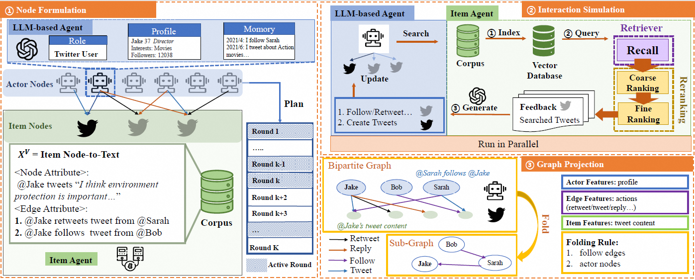

# GraphAgent: LLM-Based Multi-Agent Systems are Scalable Graph Generative Models
GraphAgent is a cutting-edge framework that leverages the power of Large Language Models (LLMs) to simulate human behavior and generate dynamic, text-attributed social graphs. Designed for use in **online social media, e-commerce, and paper-creation** simulation scenarios, GraphAgent facilitates deeper insights into the interactions within networks, making it an invaluable tool for research in social science, network science, and computational social simulations.


## Key Features
1. Human Behavior Simulation: Leveraging inductive knowledge from large language models (LLMs), GraphAgent simulates human behavior effectively. It constructs various text-attributed temporal social graphs, facilitating a deeper understanding of interactions within networks. 
2. The framework demonstrates the authenticity of LLM-based simulations by comparing generated graphs with real-world graphs through structural alignment and textual feature alignment. The graphs generated by GraphAgent adhere to seven key macroscopic network properties and show an 11% improvement in microscopic graph structure metrics.
3.  GraphAgent evaluates the transductive knowledge of LLMs in generating dynamic, text-attributed graphs. By comparing its capabilities to existing graph generation methods for graph expansion task, this framework highlights the potential and limitations of LLMs in this domain.

Moreover, GraphAgent can be easily adjusted for social science research. Researchers can leverage LLM-based Agent-Based Models (ABMs) to investigate mechanisms of graph evolution and analyze patterns of human behavior. We have investigated the potential of LLM-based agents in the paper-creation scenario. Details about this part of work is avaible in https://anonymous.4open.science/r/CiteAgent.

## GraphAgent Framework
Before we begin, please set your api key in "LLMGraph\llms\default_model_configs.json", and format it like:
```json
\[
    // GPT api key
    {
        "model_type": "openai_chat",
        "config_name": "gpt-3.5-turbo-0125",
        "model_name": "gpt-3.5-turbo-0125",
        "api_key": "sk-*",
        "generate_args": {
            "max_tokens": 2000,
            "temperature": 0.8
        }
},
    // VLLM Server api key
 {
        "config_name": "llama3-70B",
        "model_type": "openai_chat",
        "model_name": "llama3-70B",
        "api_key": "vllm_api",
        "client_args": {
            "base_url": "vllm_server_url"
        },
        "generate_args": {
            "temperature": 0.9,
            "max_tokens": 2000
        }
    }

\]
```

create a virtual environment for LLMGraph
```cmd
    conda create --name LLMGraph python=3.9
    conda activate LLMGraph
```

pip install agentscope\[distributed\] v0.0.4 from https://github.com/modelscope/agentscope/
```cmd
    git clone https://github.com/modelscope/agentscope/
    git reset --hard 1c993f9
    # From source
    pip install -e .[distribute]
```

Then create the experiment, and install the required packages:
    ```
    pip install -i "requirements.txt"
    ```

### Build Network Demo
```cmd
    export PYTHONPATH=./
```

- To start building social network in LLMGraph, you should first specify the dir of data and the config name, and then simply run by
    ```cmd
    python start_launchers.py
    python main.py --task tweets --config "small" --build # build from synthetic tweet data
    
    # follow/action/friend networks
    python evaluate/social/main.py
    ```

- To start building movie rating network in LLMGraph, you should first specify the dir of data and the config name, and then simply run by
    ```cmd
    python start_launchers.py
    python main.py --task movielens --config "small" --build # build from synthetic tweet data
    
    # movie rating/user projection networks
    python evaluate/movie/main.py
    ```

- To start building citation network in LLMGraph, you should first specify the dir of data and the config name, and then simply run by
    ```cmd
    python start_launchers.py
    python main.py --task citeseer --config "small" --build # build from synthetic tweet data
    
    # citation networks and etc.
    python evaluate/article/main.py
    ```


### An Illustration Vedio of Tweet Networks
visualization/social_network.mp4
<video width="640" height="480" controls>
  <source src="LLMGraph/experiments" type="video/mp4">
</video>

### Experiments
LLMGraph/experiments

### Build networks from user input only
Setting up a simulation environment from a prompt can be an efficient and straightforward way to get started, you can simply run:
```cmd
python main.py --user_input "I want to simulate authors interaction with papers. I want to generate a highly-clustered citation network with high average degree, with many well-known authors."  --build

python main.py --user_input "I want to simulate users interaction with movies. I want to generate a highly-clustered movie rating network with high average degree."  --build

python main.py --user_input "I want to simulate users interaction in tweet patform. I want to generate a highly-clustered online social networks  with high average degree."  --build

```